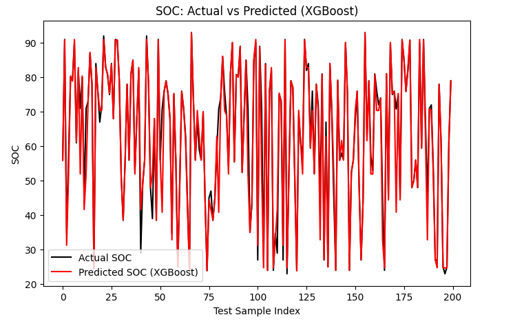
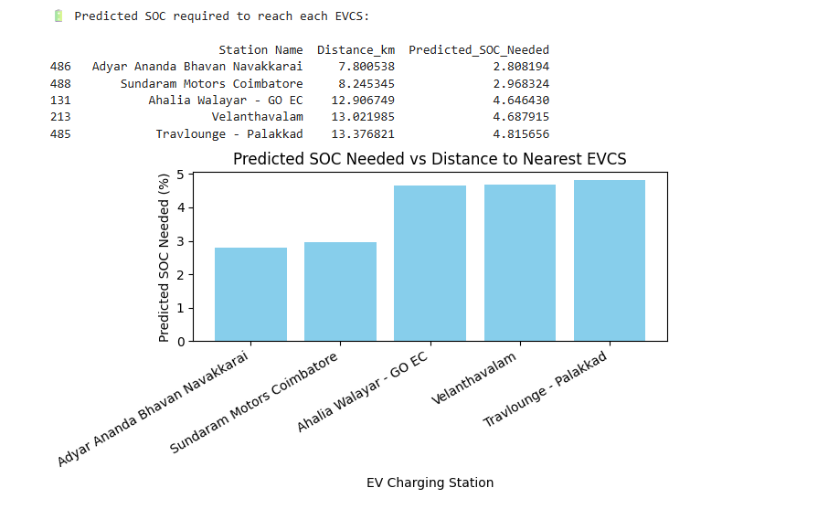
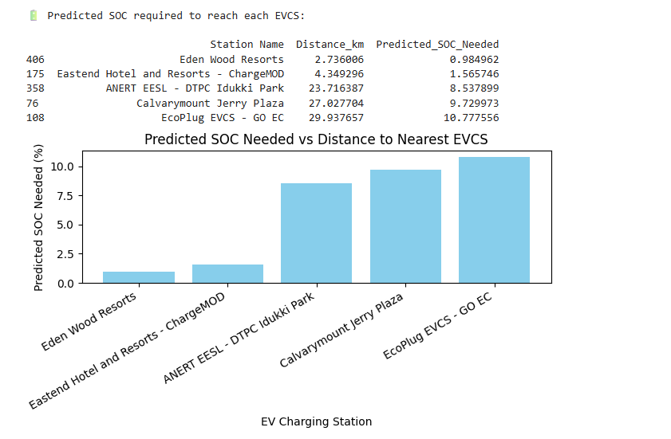

# 🔋 SoC-Aware & Geospatial Distance-Based Intelligent EV Charging Station Assistant

> An intelligent, driver-centric machine learning and geospatial recommendation framework that leverages real-time coordinates, vehicle parameters, and battery analytics to recommend the **Top 4 nearest reachable EV charging stations** along with their predicted arrival State of Charge (SoC).

---

# 📖 Project Overview

Range anxiety — the fear of running out of battery before reaching a charging point — remains one of the biggest barriers to electric vehicle adoption.

Traditional navigation systems primarily consider:

- Road distance
- Estimated travel time
- Traffic conditions

However, they ignore one of the most important parameters:

🔋 **Remaining battery capacity**

This project solves this problem by combining:

- 📡 Geospatial distance calculations
- 🤖 Machine Learning based energy prediction
- 🔋 Remaining SoC estimation
- 📍 Intelligent charging station recommendation

---

# 🎯 Project Objectives

- Predict battery consumption for upcoming trips.
- Estimate remaining battery percentage after travel.
- Identify reachable charging stations.
- Recommend the most suitable charging stations.
- Reduce range anxiety for EV users.

---

# 🌟 Key Features

✅ State of Charge Prediction  
✅ Geospatial Charging Station Recommendation  
✅ Multi-Terrain Validation  
✅ Machine Learning Based Energy Forecasting  
✅ Reachability Analysis  
✅ Driver-Centric Recommendation System  

---

# 🛰️ Geospatial Processing Engine

The recommendation engine uses the **Haversine Formula** to calculate the great-circle distance between:

- User location
- Charging station coordinates

This allows the system to identify the nearest charging stations from hundreds of available stations.

### Responsibilities

- GPS coordinate processing
- Distance computation
- Charging station ranking
- Reachability estimation

---

# 🤖 Predictive Battery Analytics

The battery prediction engine estimates:

- Energy consumption
- Remaining battery percentage
- Arrival SoC

using machine learning models trained on historical discharge datasets.

---

# 🏗️ Modular Architecture

The framework is divided into three major layers.

┌────────────────────────────┐
│ Interactive Frontend UI    │
│----------------------------│
│ • User Location Input      │
│ • Remaining SoC Display    │
│ • Charging Recommendations │
└────────────┬───────────────┘
             │
             ▼
┌────────────────────────────┐
│ Computational Backend      │
│----------------------------│
│ • Haversine Distance Engine│
│ • XGBoost Prediction Model │
│ • Reachability Filtering   │
└────────────┬───────────────┘
             │
             ▼
┌────────────────────────────┐
│ Database Layer             │
│----------------------------│
│ • Charging Station Dataset │
│ • Historical SoC Dataset   │
└────────────────────────────┘

# 🔄 Core Architecture Flow

User Coordinates Provided
        │
        ▼
Haversine Distance Calculation
        │
        ▼
Nearest Charging Station Search
        │
        ▼
Machine Learning Energy Prediction
        │
        ▼
Remaining SoC Estimation
        │
        ▼
Reachability Filtering
        │
        ▼
Top 4 Reachable Charging Stations
        │
        ▼
Driver Dashboard Display

# 🖼️ System Framework Schematic

The framework routes user geo-locations through the analytical engine before presenting recommendations to the driver interface.

---

# 🔐 Machine Learning Predictor Analysis

The prediction engine trains on historical vehicle telemetry data containing:

- Vehicle speed
- Travel distance
- Elevation differences
- Travel time
- Battery discharge characteristics

Two machine learning models were evaluated.

---

## 🌲 Random Forest Configuration

| Parameter | Value |
|-----------|-------|
| Estimators | 100 |
| Maximum Depth | 15 |
| Random State | 42 |

---

## 🚀 XGBoost Configuration

| Parameter | Value |
|-----------|-------|
| Estimators | 300 |
| Learning Rate | 0.05 |
| Maximum Depth | 6 |
| Random State | 42 |

---

# 📊 Performance Evaluation

| Evaluation Metric | Random Forest | XGBoost (Selected) |
|------------------|--------------|--------------------|
| Mean Absolute Error (MAE) | 1.9594 | **1.9054** |
| Root Mean Squared Error (RMSE) | 5.3482 | **5.2706** |
| Mean Squared Error (MSE) | 28.6034 | **27.7796** |
| R² Score | 0.9304 | **0.9324** |

The XGBoost model consistently outperformed Random Forest across all validation metrics and was selected as the final deployment model.

# 📈 Performance Comparison

---

# 🚀 Validation Case Studies

The system was validated using charging infrastructure data from both urban and mountainous regions.

---

# 🏙️ Case Study 1 — Coimbatore, Tamil Nadu

### Input Coordinates

Latitude  : 10.9085
Longitude : 76.9098

### Environment Profile

- Urban environment
- Flat terrain
- High charging station density

### Additional Calibration

A distance scaling factor of approximately **1.8** was introduced to convert great-circle distances into practical road distances.

### Result Visualization

---

# ⛰️ Case Study 2 — Munnar, Kerala

### Input Coordinates

Latitude  : 10.0500
Longitude : 77.0500

### Test Location

Pallivasal Tea Factory
Munnar, Kerala

### Environment Profile

- Mountainous terrain
- Large elevation changes
- Sparse charging infrastructure

---

### Result Visualization

---

# 📂 Repository Structure

ev-charging-recommendation-system/
│
├── datasets/
│   ├── kagglesoc.csv
│   └── unique_stations_dataset.csv
│
├── hardware_software_assets/
│   ├── architecture_block.png
│   ├── model_comparison.png
│   ├── case_study_1_cbe.png
│   └── case_study_2_munnar.png
│
├── model/
│   ├── train_soc_model.py
│   └── station_finder.py
│
├── paper/
│   └── research_paper.pdf
│
├── LICENSE
└── README.md

---

# 📁 Important Repository Files

## Dataset Files

📄 [Battery Dataset](datasets/kagglesoc.csv)

📄 [Charging Station Dataset](datasets/unique_stations_dataset.csv)

---

## Machine Learning Files

🤖 [Model Training Script](model/train_soc_model.py)

Responsible for:

- Data preprocessing
- Feature engineering
- Model training
- Hyperparameter tuning
- Validation

---

📍 [Charging Station Recommendation Engine](model/station_finder.py)

Responsible for:

- Haversine calculations
- Distance ranking
- Reachability estimation
- Recommendation generation

---

# 🛠️ Technical Stack

## Programming Language

- Python 3

---

## Data Processing Libraries

- pandas
- numpy
- math

---

## Machine Learning Frameworks

- XGBoost
- Scikit-Learn

---

## Visualization

- matplotlib

---

## Frontend Technologies

- React.js
- Next.js
- Tailwind CSS

---

# 🔮 Future Enhancements

## 🌐 Dynamic Routing APIs

Future versions will replace Haversine calculations with:

- Google Maps API
- OpenRouteService API
- OpenStreetMap Routing APIs

Benefits:

- Live traffic awareness
- Road distance calculations
- Route optimization

---

## 🌡️ Environmental Feature Injection

Additional features under development:

- Ambient temperature
- Battery aging effects
- Passenger load
- HVAC usage
- Traffic conditions

These parameters are expected to improve prediction accuracy under extreme operating conditions.

---

# 📄 Research Publication

This work is based on our academic publication.

📄 [Read the Full Research Paper](paper/research_paper.pdf)

---

## Citation

@article{vignesvaran2026evcs,
  title={A Driver-Centric SoC and Geospatial Distance-Based Intelligent System for EV Charging Station Assistance},
  author={Vignesvaran, K A and Shuhash, S K and Yadunandann, S and Hrithika, D and Ponsutharshan, D and Lekshmi, R R},
  journal={Department of Electrical and Electronics Engineering, Amrita School of Engineering},
  year={2026}
}

---

# 👨‍💻 Authors

- K A Vignesvaran
- S K Shuhash
- Yadunandann S
- Hrithika D
- Ponsutharshan D
- Dr. Lekshmi R R (Faculty Advisor)

Department of Electrical and Electronics Engineering  
Amrita School of Engineering, Coimbatore  
Amrita Vishwa Vidyapeetham

---

# 📜 License

This project is released under the MIT License.
